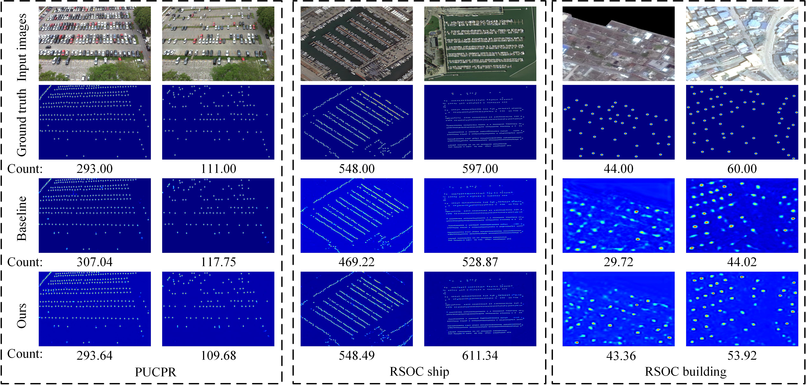

# Balanced Density Regression Network for Remote Sensing Object Counting
## ● Training Preparation
### Environment
☑️pytorch 1.8.1  
☑️CUDA 11.4  
☑️python 3.8.10  
### Requirements
Run ```pip install -r requirements.txt```
### DataSet Example
Click [here](https://lafi.github.io/LPN/) to download the PUCPR dataset.  
Then, modify the default path of the dataset in [setting.py](datasets/PUCPR/setting.py).
### Available GPU IDs
Modify the available GPU devices in [config.py](config.py)
## ● Training
Run ```python train.py```  
The training log is saved in ```./exp/Your_EXP_Name/code/log/training.txt```
## ● Training Without Visdom
If you do not want to visualize the training process, you can comment the relevant ```visdom``` code in [trainer.py](trainer.py).
For example, line 20, 22-25 and 160-162 in [trainer.py](trainer.py).
## ● Overall Results:
### Figure

### Table
|Dataset|MAE|MSE|
| :---:         |     :---:      |          :---: |
|PUCPR|1.55|1.93|
### Training Log
The training log of above result in PUCPR can be found in this [file](https://docs.qq.com/doc/DQ21tQ3d0aldhTlBR)
### Citing
If this work is helpful for your research, please consider citing:

```
@ARTICLE{BDRNet,

  author={Guo, Haojie and Gao, Junyu and Yuan, Yuan},

  journal={IEEE Transactions on Geoscience and Remote Sensing}, 

  title={Balanced Density Regression Network for Remote Sensing Object Counting}, 

  year={2024},

  volume={62},

  number={},

  pages={1-13},

  keywords={Balanced Gaussian regression;remote object counting;attention mechanism;pixel-wise estimation},

  doi={10.1109/TGRS.2024.3402271}}
```
